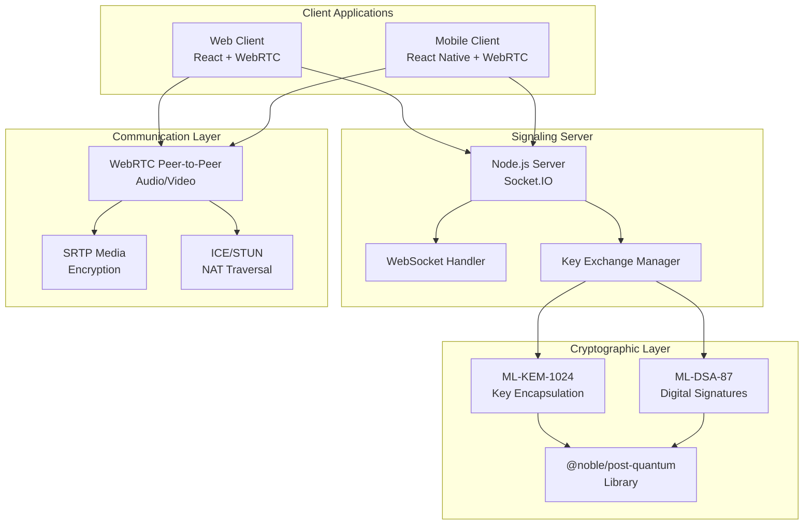
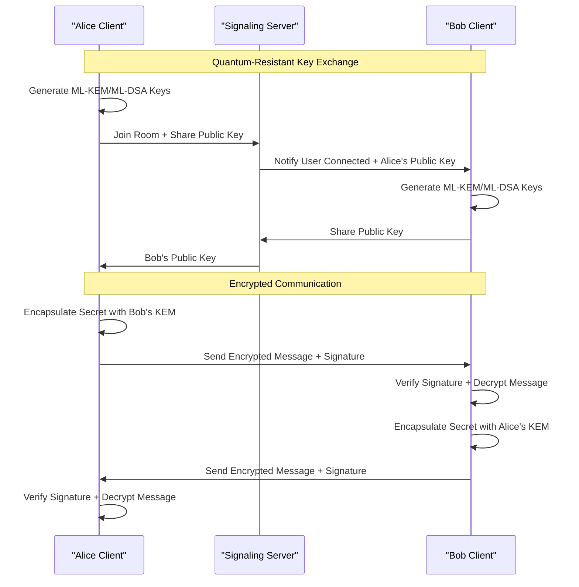
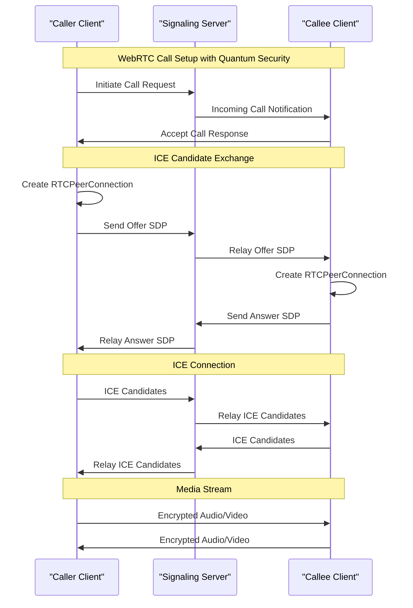
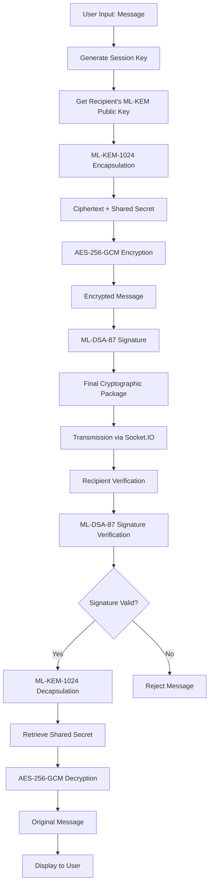
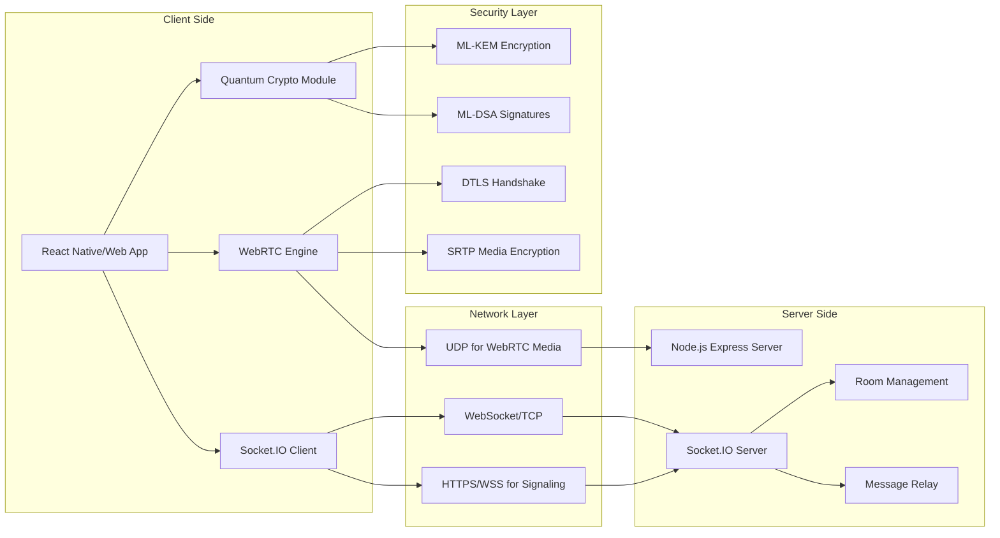
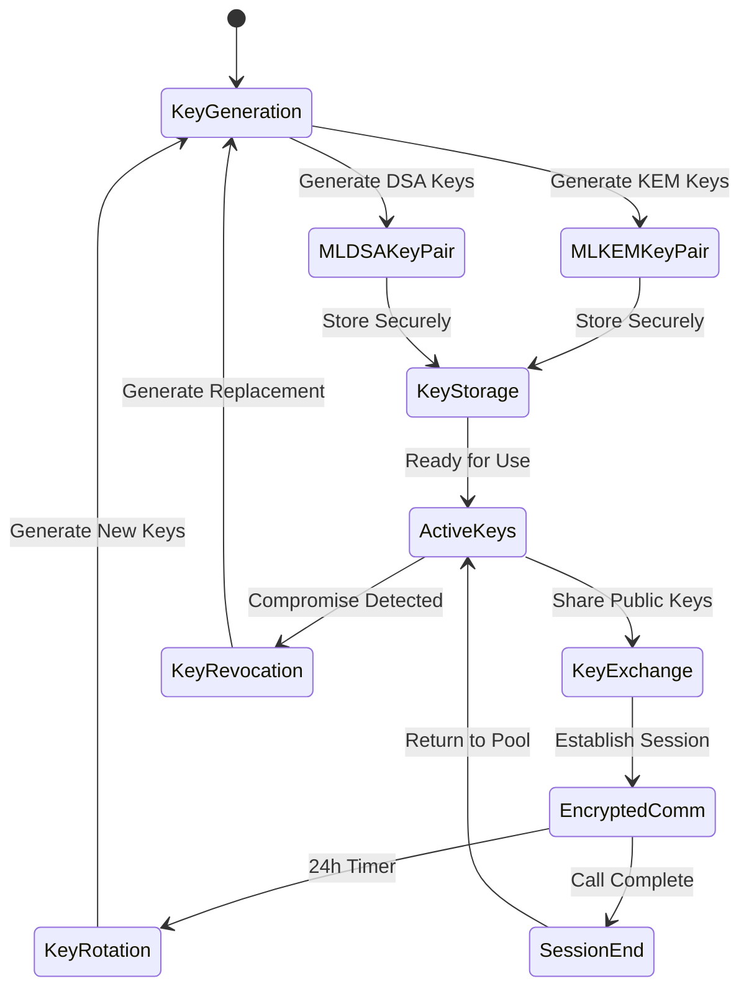
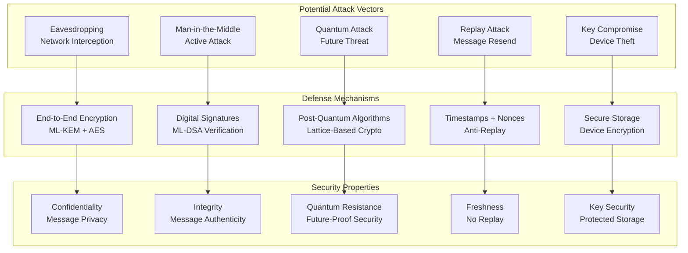
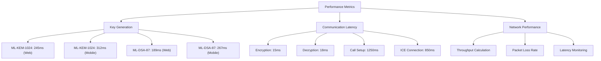
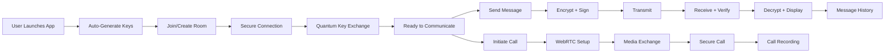
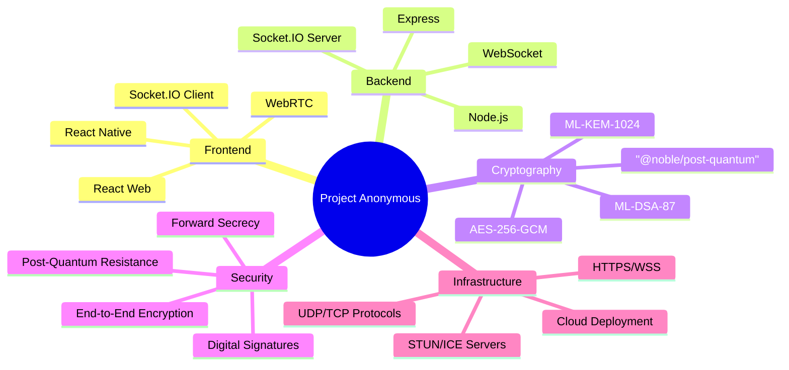

# Project Anonymous - System Architecture and Flow Diagrams

## System Architecture Overview

## Quantum Key Exchange Flow

## WebRTC Call Establishment Flow

## Cryptographic Protocol Flow

## Network Communication Architecture

## Key Management Lifecycle

## Security Threat Model

## Additional Performance Metrics Diagram

## User Experience Flow

## Technology Stack Overview

